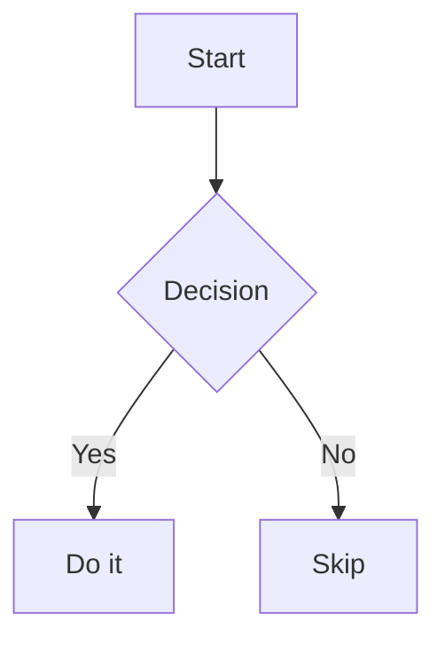

# Nabla Notes

A minimalist Android note-taking app backed by OneDrive. Write plain text and Markdown notes — including Mermaid diagrams — synced to your Microsoft account.

---

## Features

- **OneDrive sync** — notes stored in a configurable OneDrive folder via Microsoft Graph API
- **Markdown rendering** — Markwon: headings, bold, lists, tables, checkboxes, strikethrough, links, code blocks
- **Mermaid diagrams** — render flowcharts, sequence diagrams, and more inline (mermaid.ink)
  - Tap → fullscreen view with pinch-to-zoom
  - Long-press → save diagram as PNG to gallery
- **Rich Markdown toolbar** — always-visible compact toolbar: bold, italic, headings, lists, checkboxes, code blocks, tables, undo/redo
- **Autosave** — 2-second debounce, no save button needed
- **Undo/redo** — full undo/redo stack in the editor
- **Folder navigation** — browse OneDrive folder hierarchy
- **Foldable / tablet support** — split-pane layout on medium/expanded window sizes
- **MSAL authentication** — secure sign-in with Microsoft personal accounts
- **Material You** — dynamic color on Android 12+

---

## Requirements

- Android 8.0+ (API 26+)
- Microsoft personal account with OneDrive
- Azure AD app registration (shared across Nabla apps — see below)

---

## Build

### 1. Clone

```bash
git clone https://github.com/Nabla-Consulting/nabla-notes.git
cd nabla-notes
```

### 2. Create `local.properties`

```properties
sdk.dir=/path/to/Android/Sdk
msal.clientId=<YOUR_AZURE_CLIENT_ID>
```

> `local.properties` is git-ignored and never committed.

### 3. Create `msal_config.json`

Copy the template and fill in your values:

```bash
cp msal_config.template.json app/src/main/res/raw/msal_config.json
```

```json
{
  "client_id": "<YOUR_AZURE_CLIENT_ID>",
  "authorization_user_agent": "DEFAULT",
  "redirect_uri": "msauth://com.nabla.notes/<YOUR_SIGNATURE_HASH>",
  "account_mode": "SINGLE",
  "broker_redirect_uri_registered": false,
  "authorities": [
    {
      "type": "AAD",
      "audience": { "type": "PersonalMicrosoftAccount" }
    }
  ]
}
```

### 4. Build

```bash
./gradlew assembleDebug
# APK: app/build/outputs/apk/debug/com.nabla.notes-debug.apk
```

---

## Azure AD App Registration

1. Go to [Azure Portal → App Registrations](https://portal.azure.com/#blade/Microsoft_AAD_IAM/ActiveDirectoryMenuBlade/RegisteredApps)
2. Open (or create) the shared Nabla app registration
3. Navigate to **Authentication → Add a platform → Android**
4. Package name: `com.nabla.notes`
5. Signature hash (debug):
   ```bash
   keytool -exportcert -alias androiddebugkey \
     -keystore ~/.android/debug.keystore \
     | openssl sha1 -binary | openssl base64
   ```
6. Copy the generated redirect URI into `msal_config.json`

---

## First-Time Setup (In-App)

1. Launch the app → tap **Sign in with Microsoft**
2. Complete the Microsoft sign-in flow
3. Open **Settings** (gear icon)
4. Tap **Change Folder** → select the OneDrive folder where your notes live
5. Navigate back — notes load automatically

---

## Mermaid Diagrams

In any `.md` note, write a fenced code block with `mermaid`:

````

````

The diagram renders inline via mermaid.ink.

- **Single tap** → opens fullscreen view with pinch-to-zoom and a close button
- **Long-press** → saves the diagram as a PNG to your device gallery

---

## Project Structure

```
app/src/main/kotlin/com/nabla/notes/
├── MainActivity.kt               # Entry point, single/split-pane routing
├── NotepadApp.kt                 # Application class (Hilt)
├── di/
│   └── AppModule.kt              # Hilt dependency graph
├── model/
│   ├── AppSettings.kt            # DataStore settings model
│   └── NoteFile.kt               # OneDrive file model
├── repository/
│   ├── OneDriveRepository.kt     # Graph API file operations
│   └── SettingsRepository.kt     # DataStore persistence
├── ui/
│   ├── browser/
│   │   └── FileBrowserScreen.kt  # File list + create dialog
│   ├── editor/
│   │   └── EditorScreen.kt       # Text / Markdown + Mermaid editor
│   ├── settings/
│   │   └── SettingsScreen.kt     # Folder picker + sign-out
│   └── theme/
│       └── NotepadTheme.kt       # Material You theme
├── auth/
│   └── MsalManager.kt            # MSAL auth wrapper
└── viewmodel/
    ├── BrowserViewModel.kt
    ├── EditorViewModel.kt
    └── SettingsViewModel.kt
```

---

## Tech Stack

| Component | Library |
|-----------|---------|
| UI | Jetpack Compose + Material3 |
| DI | Hilt |
| Auth | MSAL 5.x |
| Storage | Microsoft Graph API (OkHttp) |
| Markdown | Markwon (core, tables, tasklist, strikethrough, linkify, image) |
| Diagrams | mermaid.ink (WebView) |
| Async | Coroutines + StateFlow |
| Architecture | MVVM + Repository |

---

## Notes

- `msal_config.json` cannot use `BuildConfig` at runtime — the client ID must be a literal string. Update both `local.properties` and `msal_config.json` when changing environments.
- Only `.txt` and `.md` files are shown in the browser. Configure the folder in Settings.
- Gallery save requires no extra permissions on API 29+ (uses `MediaStore`).
- New file dialog defaults to `YYYY-MM-DD_Note` filename format.

---

## Version

`1.0`

---

## License

Private / personal use.
